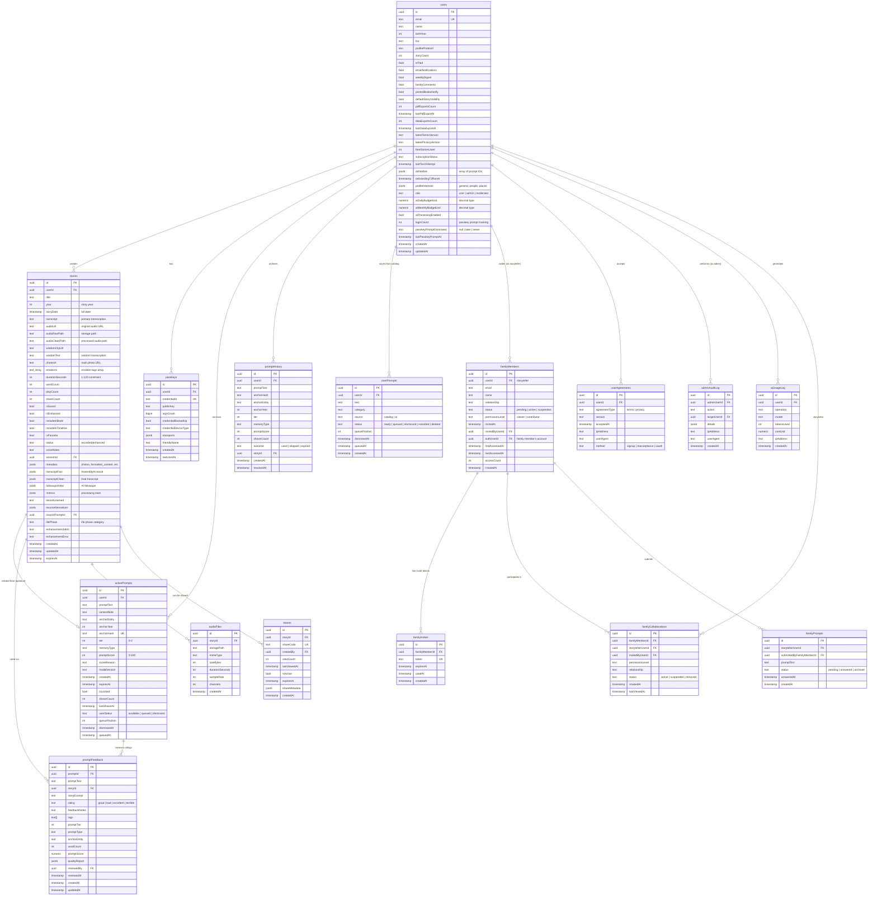

# HeritageWhisperV2 - Complete Data Model Documentation

> **Version:** 3.0  
> **Last Updated:** October 30, 2025  
> **Schema Version:** 22 production tables + 1 view, verified against live Supabase database  
> **Purpose:** Developer-focused documentation of database schemas, service models, and UI data structures  
> **Note:** This doc uses TypeScript conventions (camelCase). Database uses snake_case - see [Field Naming](#field-naming-convention) for details.  
> ⚠️ **Important:** `shared/schema.ts` defines types for both production tables AND planned/legacy tables. Always verify table exists in database before querying.

## Table of Contents
1. [Overview](#overview)
2. [Field Naming Convention](#field-naming-convention)
3. [Database Schema Layer](#database-schema-layer)
4. [Common Anti-Patterns](#common-anti-patterns)
5. [Database Objects (RPC, Views, Triggers)](#database-objects)
6. [Service Layer Models](#service-layer-models)
7. [UI Data Models](#ui-data-models)
8. [Key Relationships](#key-relationships)
9. [Data Flow Patterns](#data-flow-patterns)
10. [Auxiliary Tables Reference](#auxiliary-tables-reference)
11. [Legacy/Planned Tables](#legacy-planned-tables)
12. [Schema Reference](#schema-reference)

---

## Overview

HeritageWhisperV2 uses a **three-layer data architecture**:

- **Database Layer (PostgreSQL):** 22 production tables + 1 view managed via Supabase
- **Service Layer (Next.js API Routes):** REST API with JWT authentication, direct Supabase client queries
- **UI Layer (React/TypeScript):** TanStack Query v5 for state management

**Key Technologies:**
- Database: PostgreSQL 17+ via Supabase (project: tjycibrhoammxohemyhq)
- Schema Definition: Drizzle ORM for type-safe schemas (shared/schema.ts)
- API: Next.js 15 App Router API routes using Supabase client directly
- State: TanStack Query v5 + React Context
- Auth: Supabase Auth with JWT tokens + WebAuthn passkeys
- Security: Row Level Security (RLS) enabled on all tables

**Type Safety Coverage:** TypeScript types exist for both production and planned tables via Drizzle ORM

**Important:** While Drizzle ORM provides type definitions, API routes query the database using Supabase client methods (`.from("table_name")`) rather than ORM queries.

**Schema vs Database:** The Drizzle schema in `shared/schema.ts` defines types for planned features and legacy tables that may not exist in the production database. Always verify a table exists in Supabase before writing queries. See [Legacy/Planned Tables](#legacy-planned-tables) section for tables defined in code but not in production.

### Table Inventory

**Production Database (22 tables + 1 view):**
- Core User & Auth: `users`, `passkeys`, `user_agreements`
- Content: `stories`, `audio_files`, `shares`
- AI Prompts: `active_prompts`, `prompt_history`, `user_prompts`, `prompt_feedback`
- Family Sharing: `family_members`, `family_invites`, `family_collaborations`, `family_prompts`
- Admin/Monitoring: `admin_audit_log`, `ai_usage_log`
- System/Future: `recording_sessions`, `subscriptions`, `gift_passes`, `events`, `usage_tracking`, `activity_notifications`
- Views: `prompt_quality_stats`

**Code-Only Tables (7 in schema.ts, NOT in production):**
- `profiles`, `follow_ups`, `historical_context`, `ghost_prompts`, `demo_stories`, `shared_access`, `family_activity`

**Total:** 22 production tables + 7 code-only = 29 table definitions in `shared/schema.ts`

---

## Field Naming Convention

**Critical for Development:** HeritageWhisperV2 uses different naming conventions at different layers:

| Layer | Convention | Example | Usage |
|-------|-----------|---------|-------|
| **Database (PostgreSQL)** | snake_case | `story_year`, `audio_url` | Raw SQL, migrations, RLS policies |
| **TypeScript/Drizzle** | camelCase | `storyYear`, `audioUrl` | Application code, type definitions |
| **Supabase Client Queries** | snake_case | `.eq('user_id', id)` | API route filters |

**Automatic Mapping:** Drizzle ORM automatically maps between snake_case (DB) and camelCase (TypeScript). When you query:
```typescript
const story = await db.select().from(stories).where(eq(stories.userId, id))
```
Drizzle converts `stories.userId` → `user_id` in the SQL query.

**Manual Mapping Required:** Supabase client queries use database names directly:
```typescript
// Correct - database field names
const { data } = await supabase.from('stories').select('*').eq('user_id', userId)

// Result has snake_case fields - must map to camelCase for TypeScript
const mappedStory = { storyYear: data.story_year, audioUrl: data.audio_url }
```

**When Writing SQL:** Migrations, RLS policies, and RPC functions must use snake_case.

---

## Database Schema Layer

### Entity-Relationship Diagram (Production Tables)

> **Note:** This diagram shows the 16 core production tables used in primary features. System/future tables (`audio_files`, `shares`, `recording_sessions`, `subscriptions`, `gift_passes`, `events`, `usage_tracking`, `activity_notifications`) are documented in the [Auxiliary Tables Reference](#auxiliary-tables-reference) section. Tables defined in `shared/schema.ts` but not in production (7 legacy/planned tables) are listed in [Legacy/Planned Tables](#legacy-planned-tables).



### Table Descriptions

#### Core User Tables (3)

**1. users** - Main user accounts with authentication and preferences
- Primary authentication table (linked to `auth.users`)
- RBAC support via `role` column (user, admin, moderator)
- AI budget control (`aiDailyBudgetUsd`, `aiMonthlyBudgetUsd`) stored as NUMERIC (decimal) type
- Notification preferences (email, weekly digest, family comments)
- Export tracking (PDF and data export counts with timestamps)
- Subscription status tracking
- Passkey prompt management (`loginCount`, `passkeyPromptDismissed`, `lastPasskeyPromptAt`)

**2. passkeys** - WebAuthn credentials for passwordless authentication
- Multiple passkeys per user (Touch ID, Face ID, security keys)
- Device tracking (`credentialDeviceType`, `friendlyName`)
- Security: Composite unique constraint prevents cross-tenant credential reuse
- Tracks usage with `signCount` and `lastUsedAt`

**3. userAgreements** - Terms of Service and Privacy Policy tracking
- Legal compliance requirement
- Version tracking for terms/privacy changes
- Method tracking (signup, reacceptance, OAuth)
- IP address and user agent for audit trail

#### Content Tables (3)

**4. stories** - User-generated story content
- **Core content table** with audio, transcription, photos
- **Processing pipeline**: `status` tracks workflow (recorded → enhanced), `isSaved`, `isEnhanced` flags
- **Audio management**: `audioUrl`, `audioRawPath`, `audioCleanPath` for file paths
- **Transcription**: `transcript` (main text), `transcriptFast`/`transcriptClean` (JSONB for AI processing results)
- **Engagement tracking**: `playCount`, `shareCount`, `wordCount`
- **Display flags**: `includeInBook`, `includeInTimeline`, `isFavorite`
- **Metadata**: `year`, `storyDate`, `lifePhase`, `emotions` (text[] array), `photoUrl`
- **AI features**: `lessonLearned` (text), `lessonAlternatives` (JSONB), `followupsInitial` (JSONB)
- **Async processing**: `enhancementJobId`, `enhancementError`, `sessionId`
- **Source tracking**: `sourcePromptId` links to the prompt that inspired this story
- **JSONB metadata column**: Contains additional structured data (see below)

**stories.metadata JSONB Structure:**
```typescript
{
  life_age?: number,              // User's age at time of story
  include_in_timeline?: boolean,  // Timeline visibility (default true)
  include_in_book?: boolean,      // Book inclusion (default true)
  is_favorite?: boolean,          // Favorite flag
  photos?: Array<{                // Multiple photos with transforms
    id: string,
    url: string,
    transform?: { zoom: number, position: {x: number, y: number} },
    caption?: string,
    isHero?: boolean
  }>,
  photo_transform?: {             // Legacy single photo transform
    zoom: number,
    position: {x: number, y: number}
  },
  pivotal_category?: string,      // Story category
  formatted_content?: object,     // AI-formatted story content
  actual_duration?: number        // Original duration if clamped for DB
}
```

**Why JSONB?** Flexible storage for optional fields and evolving features without schema migrations. Query with: `.select('metadata->photos')` or access via TypeScript after fetch.

**5. audioFiles** - Storage metadata for audio recordings
- Links to stories table
- Tracks file metadata: `storagePath`, `mimeType`, `sizeBytes`
- Audio specs: `durationSeconds`, `sampleRate`, `channels`
- Enables storage cleanup and migration

**6. shares** - Public share links for individual stories
- Token-based public sharing (distinct from family sharing)
- `shareCode` unique identifier for URLs
- Analytics: `viewCount`, `lastViewedAt`
- Control: `isActive`, `expiresAt` for access management

#### AI Prompt System Tables (5)

**7. activePrompts** - Currently active AI-generated prompts
- **Tier-based system** (0=fallback, 1=template, 2=on-demand, 3=milestone)
- **Deduplication via `anchorHash`**: sha1 hash of `tier|entity|year` prevents duplicate prompts about same topic
  - **Why SHA1**: Fast, collision-resistant for our scale, consistent across API calls
  - **Why hash at all**: Prevents "Tell me about your father" appearing twice for same year
- **Quality scoring** (0-100): GPT-4o predicts likelihood user will record this prompt
  - Used to prioritize high-quality prompts in the UI
- **User queue management**: `userStatus` ('available'|'queued'|'dismissed'), `queuePosition`
- **Expiration-based**: 7-day default TTL
  - **Why 7 days**: Keeps prompt pool fresh, encourages timely recording, prevents stale content
  - Archived to `promptHistory` after expiration for analytics
- **Paywall support**: `isLocked` flag hides Tier 2+ prompts from free users

**8. promptHistory** - Archived used/skipped/expired prompts
- Tracks prompt lifecycle outcomes
- Links to resulting story if used
- Analytics for prompt effectiveness

**9. userPrompts** - User-saved prompts from catalog
- **Separate from AI-generated prompts** (activePrompts)
  - **Why separate tables**: Different UX flows and lifecycles
    - `activePrompts`: Ephemeral (7-day TTL), AI-managed, automatic deduplication
    - `userPrompts`: Permanent (until user deletes), user-controlled, no expiration
  - **Why this matters**: User expects saved prompts to persist indefinitely, but AI prompts should rotate
- **Queue management**: User organizes prompts via `queuePosition` for recording order
- **Status tracking**: ready, queued, dismissed, recorded, deleted (default: `saved`)
- **Source tracking**: `source` field ('catalog'|'ai') identifies origin for analytics

**10. promptFeedback** - Quality ratings for AI prompts (admin tool)
- Admin dashboard feature for prompt quality analysis
- Ratings: good, bad, excellent, terrible
- Tags and quality reports for analytics
- Links to prompt and resulting story
- Used to improve prompt generation over time

#### Family Sharing V3 Tables (4)

**11. familyMembers** - Family member invitations and access
- Storyteller invites family members via email
- Three user references:
  - `userId`: The storyteller
  - `invitedByUserId`: Who sent the invite
  - `authUserId`: Family member's own account (when registered)
- Permission levels: viewer (read-only), contributor (can submit questions)
- Status: pending, active, suspended
- Access tracking: first/last accessed, access count

**12. familyInvites** - Token-based invitation system
- Unique tokens for invite links (7-day expiration)
- Expiration tracking
- Tracks when invite was used (one-time use)

**13. familyCollaborations** - Multi-tenant access control (JOIN table)
- Links family members to storyteller accounts
- Permission management per collaboration
- Status tracking (active, suspended, removed)
- Last viewed tracking for engagement analytics
- **Critical for multi-tenant security** (used by `has_collaboration_access()` RPC)

**14. familyPrompts** - Family-submitted questions
- Contributors can submit custom questions to storytellers
- Status: pending, answered, archived
- Links to resulting story when answered

#### Admin & Monitoring Tables (2)

**15. adminAuditLog** - Admin action audit trail
- Security and compliance requirement
- Tracks all admin actions (user management, content moderation)
- IP address and user agent logging
- JSONB details for action-specific data
- **Critical for GDPR compliance**

**16. aiUsageLog** - AI API usage and cost tracking
- Tracks every AI operation (transcription, prompt generation, etc.)
- Cost tracking in USD (numeric/decimal type with 6 decimal precision)
- Used by `check_ai_budget()` RPC for budget enforcement
- Analytics for AI feature usage
- Enables cost visibility and budget limits per user

---

## Common Anti-Patterns

**⚠️ Critical:** These mistakes can lead to security vulnerabilities, performance issues, or data corruption.

### ❌ Anti-Pattern #1: Bypassing Multi-Tenant Access Control

**Wrong:**
```typescript
// INSECURE - Bypasses family sharing permissions
const { data } = await supabase
  .from('stories')
  .select('*')
  .eq('user_id', targetUserId)
```

**Right:**
```typescript
// SECURE - Always verify collaboration access first
const { data: hasAccess } = await supabase.rpc('has_collaboration_access', {
  p_user_id: currentUserId,
  p_storyteller_id: targetUserId
})

if (!hasAccess) {
  throw new Error('Unauthorized access')
}

// Now safe to query
const { data } = await supabase
  .from('stories')
  .select('*')
  .eq('user_id', targetUserId)
```

**Why:** The `has_collaboration_access()` RPC is the single source of truth for multi-tenant security. Bypassing it allows unauthorized access to other users' data.

**Where used:** `app/api/stories/route.ts`, `app/api/family/stories/[userId]/route.ts`

---

### ❌ Anti-Pattern #2: Using Service Role Key Without RLS Awareness

**Wrong:**
```typescript
// Uses service role key - BYPASSES RLS!
const { data } = await supabaseAdmin
  .from('stories')
  .select('*')
  .eq('user_id', untrustedInput) // Vulnerable to injection
```

**Right:**
```typescript
// Explicitly verify authorization before using service role
const authenticatedUserId = await verifyJWT(token)

// Verify user can access this data
if (targetUserId !== authenticatedUserId) {
  const hasAccess = await verifyCollaborationAccess(authenticatedUserId, targetUserId)
  if (!hasAccess) throw new Error('Unauthorized')
}

// Now safe to use service role
const { data } = await supabaseAdmin
  .from('stories')
  .select('*')
  .eq('user_id', targetUserId)
```

**Why:** Service role key bypasses Row Level Security. You MUST implement authorization checks manually.

**When to use service role:** Admin operations, background jobs, cross-user operations (after verification).

---

### ❌ Anti-Pattern #3: Ignoring snake_case in Supabase Queries

**Wrong:**
```typescript
const { data } = await supabase
  .from('stories')
  .select('*')
  .eq('userId', id) // ❌ No column named 'userId'
```

**Right:**
```typescript
const { data } = await supabase
  .from('stories')
  .select('*')
  .eq('user_id', id) // ✅ Database uses snake_case
```

**Why:** Supabase queries use database column names (snake_case), not TypeScript names (camelCase). Drizzle ORM does auto-mapping, but Supabase client doesn't.

---

### ❌ Anti-Pattern #4: Storing Large Duration Values

**Wrong:**
```typescript
const story = {
  user_id: userId,
  title: 'My Story',
  duration_seconds: 600 // 10 minutes - exceeds DB constraint!
}
await supabase.from('stories').insert(story) // Will fail silently or error
```

**Right:**
```typescript
// Database has CHECK constraint: duration_seconds BETWEEN 1 AND 120
const clampedDuration = Math.min(Math.max(durationSeconds, 1), 120)

const story = {
  user_id: userId,
  title: 'My Story',
  duration_seconds: clampedDuration,
  metadata: {
    actual_duration: durationSeconds // Store original in metadata
  }
}
```

**Why:** Database has `CHECK (duration_seconds BETWEEN 1 AND 120)`. Values outside this range will fail insertion.

**Where implemented:** `app/api/stories/route.ts` line 254

---

### ❌ Anti-Pattern #5: Not Tracking AI Costs

**Wrong:**
```typescript
// Makes AI API call without logging
const result = await openai.chat.completions.create({ ... })
return result
```

**Right:**
```typescript
// Check budget first
const { data: canProceed } = await supabase.rpc('check_ai_budget', {
  p_user_id: userId,
  p_operation: 'prompt_generation',
  p_estimated_cost: 0.05
})

if (!canProceed) {
  throw new Error('AI budget exceeded')
}

// Make call
const result = await openai.chat.completions.create({ ... })

// Log usage
await supabase.rpc('log_ai_usage', {
  p_user_id: userId,
  p_operation: 'prompt_generation',
  p_model: 'gpt-4o',
  p_tokens_used: result.usage.total_tokens,
  p_cost_usd: calculateCost(result.usage),
  p_ip_address: req.ip
})
```

**Why:** Without tracking, users can exceed budgets and you lose cost visibility. The `check_ai_budget()` and `log_ai_usage()` RPCs enforce limits and provide analytics.

---

### ❌ Anti-Pattern #6: Querying activePrompts Without Expiration Check

**Wrong:**
```typescript
const { data: prompts } = await supabase
  .from('active_prompts')
  .select('*')
  .eq('user_id', userId)
// Returns expired prompts!
```

**Right:**
```typescript
const { data: prompts } = await supabase
  .from('active_prompts')
  .select('*')
  .eq('user_id', userId)
  .gt('expires_at', new Date().toISOString())
  .order('created_at', { ascending: false })
```

**Why:** Prompts expire after 7 days. Showing expired prompts confuses users. A scheduled job archives expired prompts, but you should filter client-side too.

---

## Database Objects

### RPC Functions (PostgreSQL Functions)

> **Note**: All RPC functions verified against production database (October 2025)

**AI Budget Control:**
```sql
check_ai_budget(
  p_user_id UUID,
  p_operation TEXT,
  p_estimated_cost DECIMAL
) → BOOLEAN
```
- Checks if user is within daily/monthly AI budget
- Returns false if budget exceeded
- Used before expensive AI operations

```sql
log_ai_usage(
  p_user_id UUID,
  p_operation TEXT,
  p_model TEXT,
  p_tokens_used INTEGER,
  p_cost_usd DECIMAL,
  p_ip_address TEXT
) → VOID
```
- Logs AI API usage to `ai_usage_log`
- Called after every AI operation
- Enables cost tracking and analytics

**Family Sharing:**
```sql
cleanup_expired_family_access() → VOID
```
- ⚠️ **Legacy function** - References deleted `family_sessions` table
- Attempts to delete expired invites from `family_invites`
- **Not functional** due to missing table dependency

```sql
cleanup_expired_family_sessions() → VOID
```
- ⚠️ **Legacy function** - References deleted `family_sessions` table
- **Not functional** - table no longer exists

```sql
rotate_family_session_token(p_session_id UUID) → TEXT
```
- ⚠️ **Legacy function** - References deleted `family_sessions` table
- **Not functional** - table no longer exists

**Multi-Tenant Access Control:**
```sql
has_collaboration_access(
  p_user_id UUID,
  p_storyteller_id UUID
) → BOOLEAN
```
- **Critical function for multi-tenant security**
- Checks if user can access storyteller's data
- Returns true if:
  - User is accessing own data (p_user_id = p_storyteller_id)
  - User has active family collaboration with storyteller

**Export Tracking:**
```sql
increment_pdf_export(user_uuid UUID) → VOID
increment_data_export(user_uuid UUID) → VOID
```
- ⚠️ **Partially broken** - References old column names
- Attempts to update `users.pdf_exports` (actual column: `pdf_exports_count`)
- Attempts to update `users.data_exports` (actual column: `data_exports_count`)
- **Recommendation**: Update functions or call with correct column names in application code

**Queue Management:**
```sql
get_next_queue_position(p_user_id UUID) → INTEGER
```
- ⚠️ **Partially broken** - References `user_prompts_catalog` table which doesn't exist
- Should reference `user_prompts` table instead
- Returns next available queue position
- Checks both `active_prompts` and user prompts table

**Additional Functions:**
```sql
get_user_collaborations(p_user_id UUID) → TABLE
```
- Returns all storyteller accounts this user can access
- Joins `family_collaborations`, `family_members`, and `users`
- Filters for active collaborations only

```sql
increment_view_count(share_code_param TEXT) → VOID
```
- Increments view count for shared story
- Updates `shares.view_count` and `shares.last_viewed_at`
- Also updates `stories.play_count`

### Triggers

```sql
update_updated_at_column() → TRIGGER
```
- Auto-updates `updated_at` timestamp on row modification
- Applied to: `users`, `prompt_feedback`

```sql
trigger_cleanup_expired_sessions() → TRIGGER
```
- ⚠️ **Legacy trigger** - References deleted `family_sessions` table
- **Not functional** - table no longer exists

```sql
update_prompt_feedback_updated_at() → TRIGGER
update_family_prompts_updated_at() → TRIGGER
```
- Specific auto-update triggers for feedback tables

### Views

```sql
prompt_quality_stats (VIEW)
```
- ✅ **Production view** - Aggregated statistics for prompt feedback dashboard
- Groups by: rating, prompt_tier, prompt_type
- Metrics: COUNT, AVG(prompt_score), AVG(word_count), common tags
- Used by admin dashboard for prompt system health monitoring
- **Note**: This is the only view in the production database

---

## Database Constraints

### Primary Keys
All tables use UUID primary keys with `gen_random_uuid()` default

### Unique Constraints
- `users.email` - One account per email
- `passkeys.credential_id` - Globally unique WebAuthn credentials
- `passkeys(user_id, credential_id)` - Composite unique (prevents cross-tenant clashes)
- `active_prompts.anchor_hash` - Deduplication across prompt generations
- `family_invites.token` - Unique invite tokens
- `shares.share_code` - Unique share URLs

### Foreign Key Cascades
- `passkeys.user_id` → ON DELETE CASCADE
- `active_prompts.user_id` → ON DELETE CASCADE
- `prompt_history.user_id` → ON DELETE CASCADE
- `user_prompts.user_id` → ON DELETE CASCADE
- `family_members.user_id` → ON DELETE CASCADE
- `audio_files.story_id` → Likely CASCADE (verify in migrations)
- `admin_audit_log.target_user_id` → ON DELETE SET NULL
- `prompt_feedback.story_id` → ON DELETE SET NULL

### CHECK Constraints
- `stories.duration_seconds` - Between 1 and 120 (database-level clamp)
- `stories.life_phase` - 'childhood', 'teen', 'early_adult', 'mid_adult', 'late_adult', 'senior'
- `active_prompts.tier` - Integer 0-3
- `active_prompts.prompt_score` - Integer 0-100 (or NULL)
- `active_prompts.user_status` - 'available', 'queued', 'dismissed'
- `users.role` - 'user', 'admin', 'moderator'
- `users.subscription_status` - 'none', 'active', 'cancelled', 'expired'
- `user_agreements.agreement_type` - 'terms', 'privacy'
- `user_agreements.method` - 'signup', 'reacceptance', 'oauth'
- `family_members.status` - 'pending', 'active', 'suspended'
- `family_members.permission_level` - 'viewer', 'contributor'
- `user_prompts.source` - 'catalog', 'ai'
- `user_prompts.status` - 'ready', 'queued', 'dismissed', 'recorded', 'deleted'
- `family_collaborations.status` - 'active', 'suspended', 'removed'
- `family_collaborations.permission_level` - 'viewer', 'contributor'
- `family_prompts.status` - 'pending', 'answered', 'archived'
- `prompt_history.outcome` - 'used', 'skipped', 'expired'
- `prompt_feedback.rating` - 'good', 'bad', 'excellent', 'terrible'
- `subscriptions.status` - 'trialing', 'active', 'canceled', 'incomplete', 'past_due'

### Indexes (50+ for performance)
- **User lookups:** `idx_users_role`, `idx_users_subscription_status`
- **Story queries:** `idx_stories_user_id`, `idx_stories_created_at DESC`, `idx_stories_year`
- **Prompt system:** `idx_active_prompts_user`, `idx_active_prompts_tier`, `idx_active_prompts_expires`
- **Family features:** `idx_family_members_user_status`, `idx_family_invites_token`
- **Sharing:** `idx_shares_share_code`, `idx_shares_story_id`
- **Admin functions:** `idx_admin_audit_log_created_at DESC`

---

## Service Layer Models

(Content continues with the existing Service Layer Models section, which remains accurate...)

---

## Auxiliary Tables Reference

These tables exist in production but support system operations, analytics, payments, or future features. They're not part of the primary user workflows. Documented here for completeness.

**Production Count:** 6 auxiliary tables + 16 core tables (in ERD) = 22 total production tables

> **Note:** `audio_files` and `shares` are documented in the core Content Tables section and shown in the ERD.

### recording_sessions (57 rows - Active)
**Purpose:** Temporary state for multi-step recording flow

| Field | Type | Description |
|-------|------|-------------|
| id | uuid | Primary key |
| user_id | uuid | FK to users table |
| story_prompt | text | Recording prompt text |
| user_age | integer | User age at recording |
| start_time | timestamp | Session start |
| end_time | timestamp | Session completion |
| context | text | Additional context notes |
| followup_count | integer | Number of followups asked |
| followups_asked | jsonb | Array of followup questions |
| status | text | Status: recording or completed |
| main_audio_url | text | Primary audio URL |
| wisdom_audio_url | text | Wisdom clip URL |
| wisdom_clip_text | text | Wisdom transcription |
| duration | integer | Recording duration |
| emotion_tags | text[] | Emotion array |
| created_at | timestamp | Session creation |

**Usage:** Tracks state during multi-step interview flow. Cleaned up after story finalization.

---

### subscriptions (0 rows - Schema Only)
**Purpose:** Stripe subscription management

| Field | Type | Description |
|-------|------|-------------|
| id | uuid | Primary key |
| user_id | uuid | FK to users table |
| stripe_customer_id | text | Stripe Customer ID |
| stripe_subscription_id | text | Stripe Subscription ID |
| status | text | Status: trialing, active, canceled, incomplete, past_due |
| plan_id | text | Plan identifier |
| current_period_start | timestamp | Billing period start |
| current_period_end | timestamp | Billing period end |
| cancel_at_period_end | boolean | Cancellation flag |
| created_at | timestamp | Subscription creation |
| updated_at | timestamp | Last modification |

**Usage:** Payment integration (not yet implemented in production).

---

### gift_passes (0 rows - Schema Only)
**Purpose:** Gift subscription codes

| Field | Type | Description |
|-------|------|-------------|
| id | uuid | Primary key |
| code | text | Unique redemption code |
| months | integer | Subscription duration |
| purchaser_email | text | Buyer email |
| purchaser_name | text | Buyer name |
| recipient_email | text | Recipient email |
| recipient_name | text | Recipient name |
| message | text | Gift message |
| redeemed_by | uuid | FK to users table |
| redeemed_at | timestamp | Redemption time |
| is_active | boolean | Validity flag |
| created_at | timestamp | Purchase time |
| expires_at | timestamp | Expiration (default 1 year) |

**Usage:** Gift subscription system (not yet implemented in production).

---

### events (0 rows - Schema Only)
**Purpose:** Analytics event tracking

| Field | Type | Description |
|-------|------|-------------|
| id | uuid | Primary key |
| user_id | uuid | FK to users table (nullable for anonymous) |
| event_name | text | Event type identifier |
| event_data | jsonb | Event properties |
| session_id | text | Session identifier |
| ip_address | inet | User IP (anonymized) |
| user_agent | text | Browser info |
| referrer | text | Traffic source |
| created_at | timestamp | Event time |

**Usage:** Product analytics tracking (schema exists, not actively populated).

---

### usage_tracking (0 rows - Schema Only)
**Purpose:** Service cost tracking

| Field | Type | Description |
|-------|------|-------------|
| id | uuid | Primary key |
| user_id | uuid | FK to users table |
| service | text | Service name (OpenAI, AssemblyAI, etc.) |
| tokens_used | integer | API tokens consumed |
| cost_usd | numeric | Cost in USD |
| created_at | timestamp | Usage time |

**Usage:** Cost tracking (replaced by `ai_usage_log` table which is actively used).

---

### activity_notifications (0 rows - Schema Only)
**Purpose:** Real-time notification system

| Field | Type | Description |
|-------|------|-------------|
| id | uuid | Primary key |
| recipient_family_member_id | uuid | FK to family_members |
| recipient_user_id | uuid | FK to users |
| actor_family_member_id | uuid | FK to family_members |
| actor_user_id | uuid | FK to users |
| notification_type | text | Type identifier |
| title | text | Notification title |
| message | text | Notification content |
| action_url | text | Click destination |
| story_id | uuid | FK to stories (optional) |
| prompt_id | uuid | FK to prompts (optional) |
| metadata | jsonb | Additional data |
| read_at | timestamp | Read status |
| dismissed_at | timestamp | Dismissal status |
| created_at | timestamp | Notification creation |

**Usage:** Notification system for family activity (schema exists, feature not yet implemented).

---

## Legacy/Planned Tables

**⚠️ Important:** These tables are defined in `shared/schema.ts` (Drizzle ORM) but **DO NOT exist in the production Supabase database**. TypeScript types exist, but queries will fail. Do not use these tables in new code.

### profiles (Code Only - Not in Production)
**Drizzle Definition:** Extended user personalization settings  
**Status:** Defined in schema.ts but migration never applied  
**Contains:** Life phase definitions, character traits (work ethic, risk tolerance, family orientation, spirituality), communication preferences  
**Why it exists:** Originally planned for AI personalization  
**Current state:** Profile data stored in `users.profile_interests` JSONB instead  
**Action needed:** Either migrate to production or remove from schema.ts

### follow_ups (Code Only - Not in Production)
**Drizzle Definition:** AI-generated follow-up questions for stories  
**Status:** Defined in schema.ts but never migrated  
**Contains:** `questionText`, `questionType`, `wasAnswered`  
**Current state:** Follow-up questions stored in `stories.followups_initial` JSONB  
**Action needed:** Remove from schema.ts (functionality already exists differently)

### historical_context (Code Only - Limited Usage)
**Drizzle Definition:** Cached decade-specific historical facts  
**Status:** Defined in schema.ts, used only in export/delete operations  
**Contains:** `decade`, `ageRange`, `facts` (JSONB)  
**Usage:** Only 3 file references (export, delete, schema definition)  
**Current state:** Not actively used for prompt generation  
**Action needed:** Either implement caching feature or remove from schema

### ghost_prompts (Code Only - Legacy)
**Drizzle Definition:** Original manually-created prompt system  
**Status:** Removed from database, still in schema.ts and UI components  
**Usage:** `GhostPromptCard.tsx` and timeline components still reference it  
**Current state:** Replaced by `activePrompts` + `userPrompts` system  
**Action needed:** Complete UI migration to new prompt system, remove from schema.ts  
**Timeline:** Removal planned with Timeline V4 (Q1 2026)

### demo_stories (Code Only - Not in Production)
**Drizzle Definition:** Demo account stories for onboarding  
**Status:** Defined in schema.ts but no table in production database  
**Contains:** Mirrors stories table structure with public URLs  
**Current state:** Demo functionality likely uses regular stories table  
**Action needed:** Either create demo infrastructure or remove from schema

### shared_access (Code Only - Replaced)
**Drizzle Definition:** Timeline/book sharing with permissions  
**Status:** Defined in schema.ts but replaced by `shares` table in production  
**Original purpose:** Token-based sharing for timelines/books  
**Current state:** `shares` table handles story sharing instead  
**Action needed:** Remove from schema.ts (functionality exists in shares table)

### family_activity (Code Only - Not Implemented)
**Drizzle Definition:** Family engagement tracking  
**Status:** Defined in schema.ts but feature never implemented  
**Planned purpose:** Activity feed for storyteller dashboard  
**Current state:** No production table or feature  
**Action needed:** Either implement feature or remove from schema

---

_For complete documentation including Service Layer, UI Layer, and Data Flow Patterns, see the full DATA_MODEL.md file._

---

**Schema File Reference:** [`/shared/schema.ts`](shared/schema.ts)

**Production Database:** Supabase project tjycibrhoammxohemyhq (PostgreSQL 17+)

**Row Level Security:** Enabled on all 22 production tables with optimized `(SELECT auth.uid())` pattern

**Database Objects:** 
- 22 production tables (16 core + 6 auxiliary)
- 1 view (`prompt_quality_stats`)
- 7 code-only tables in schema.ts not in production

**Schema Definitions:** 29 total table definitions in `shared/schema.ts` (22 production + 7 legacy/planned)

---

_Last verified: October 30, 2025 - All 22 production tables synchronized with live Supabase database via MCP_
