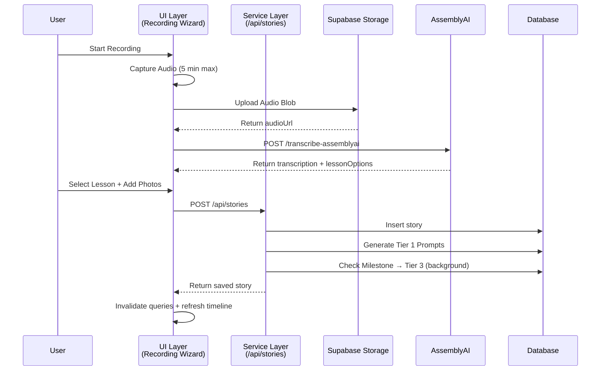
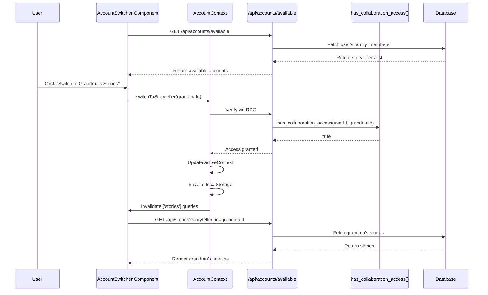
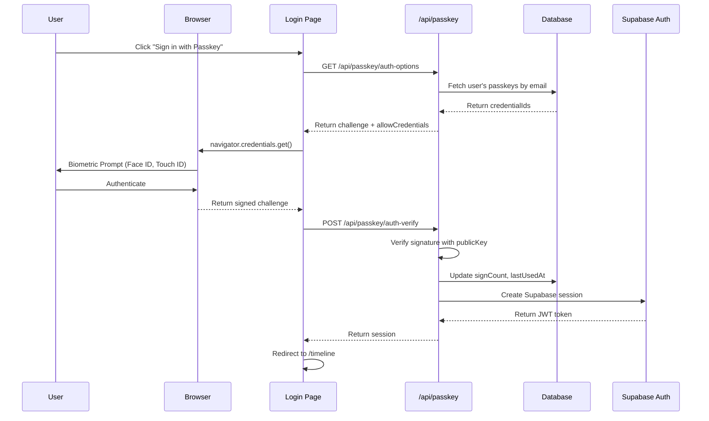
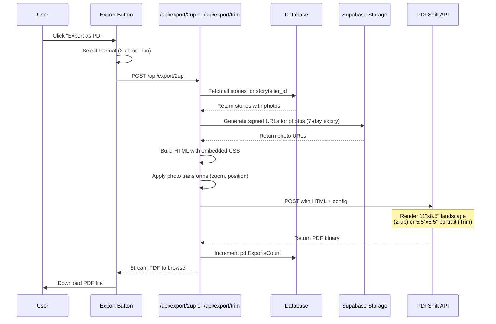
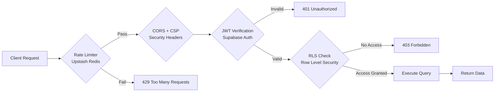
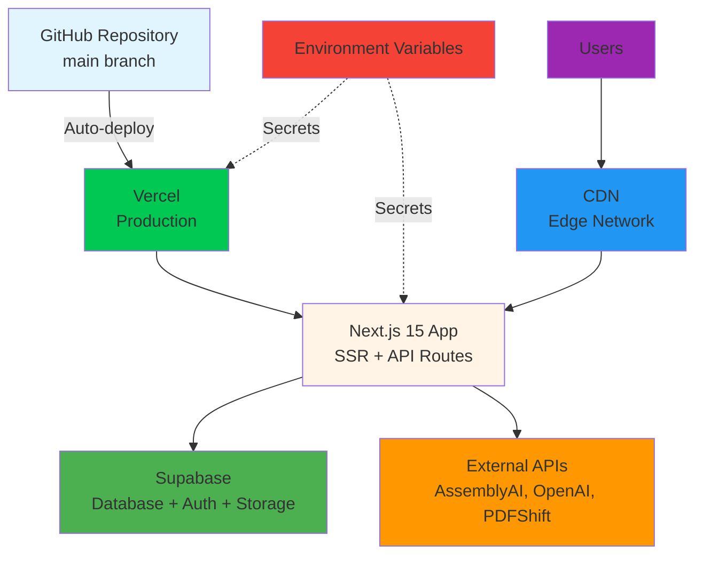

# HeritageWhisperV2 - Architecture Overview

> **Three-Layer Architecture:** Database → Service → UI

## System Architecture Diagram

```mermaid
graph TB
    subgraph "UI Layer - React/TypeScript"
        A[Components<br/>Timeline, Book, Recording]
        B[React Context<br/>AccountContext, AuthContext]
        C[TanStack Query<br/>Caching & State]
        D[Custom Hooks<br/>useRecordingWizard, useRealtimeInterview]
    end

    subgraph "Service Layer - Next.js API Routes"
        E[/api/stories<br/>CRUD operations]
        F[/api/prompts<br/>AI prompt system]
        G[/api/transcribe<br/>AssemblyAI & Whisper]
        H[/api/accounts<br/>Multi-tenant access]
        I[/api/passkey<br/>WebAuthn auth]
        J[/api/export<br/>PDF generation]
    end

    subgraph "Database Layer - PostgreSQL via Supabase"
        K[(users<br/>stories<br/>activePrompts)]
        L[(passkeys<br/>familyMembers<br/>sharedAccess)]
        M[(profiles<br/>promptHistory<br/>followUps)]
        N[Supabase Storage<br/>heritage-whisper-files]
        O[Supabase Auth<br/>JWT + Session]
    end

    subgraph "External Services"
        P[AssemblyAI<br/>Batch Transcription]
        Q[OpenAI<br/>Whisper + GPT-4o + Realtime API]
        R[PDFShift<br/>Cloud PDF Rendering]
        S[Vercel AI Gateway<br/>Model Routing & Caching]
        T[Upstash Redis<br/>Rate Limiting]
    end

    A --> C
    B --> C
    D --> C
    C --> E
    C --> F
    C --> G
    C --> H
    C --> I
    C --> J

    E --> K
    E --> N
    F --> K
    G --> P
    G --> Q
    H --> K
    H --> L
    I --> L
    I --> O
    J --> R

    F --> S
    E --> T
    G --> T

    style A fill:#e1f5ff
    style B fill:#e1f5ff
    style C fill:#e1f5ff
    style D fill:#e1f5ff
    style E fill:#fff4e6
    style F fill:#fff4e6
    style G fill:#fff4e6
    style H fill:#fff4e6
    style I fill:#fff4e6
    style J fill:#fff4e6
    style K fill:#f0f0f0
    style L fill:#f0f0f0
    style M fill:#f0f0f0
    style N fill:#e8f5e9
    style O fill:#e8f5e9
    style P fill:#fce4ec
    style Q fill:#fce4ec
    style R fill:#fce4ec
    style S fill:#fce4ec
    style T fill:#fce4ec
```

## Data Flow Patterns

### 1. Story Creation Flow



### 2. Multi-Tenant Account Switching



### 3. AI Prompt Generation Pipeline

```mermaid
flowchart TD
    A[User Saves Story] --> B{Check AI Consent}
    B -->|Disabled| Z[Return Story Only]
    B -->|Enabled| C[Generate Tier 1 Prompts]

    C --> D[Regex Entity Extraction<br/>people, places, objects, emotions]
    D --> E[Apply Quality Gates<br/>validatePromptQuality]
    E --> F[Store in active_prompts<br/>with 7-day expiry]

    C --> G[Generate Echo Prompt<br/>GPT-4o-mini immediate follow-up]
    G --> E

    F --> H{Check Story Count<br/>for Milestones}
    H -->|Not Milestone| Z
    H -->|Milestone Hit<br/>[1,2,3,4,7,10,15,20,30,50,100]| I[Trigger Tier 3 Analysis<br/>Background Job]

    I --> J{Rate Limit Check<br/>3 Layers}
    J -->|User Limit: 1/5min| K[Skip - Too Soon]
    J -->|IP Limit: 10/hour| K
    J -->|Global: 1000/hour| K
    J -->|All Pass| L[Fetch All User Stories]

    L --> M[GPT-4o/GPT-5 Combined Analysis<br/>performTier3Analysis]
    M --> N[Generate 2-5 High-Quality Prompts<br/>+ Character Insights]
    N --> O{Story Count = 3?}
    O -->|Yes| P[Lock 3 Prompts<br/>Unlock 1 for free]
    O -->|No| Q[All Unlocked]
    P --> R[Store in active_prompts]
    Q --> R

    K --> Z
    R --> Z
```

### 4. WebAuthn Passkey Authentication



### 5. PDF Export Pipeline



## Technology Stack Layers

### UI Layer
- **Framework:** Next.js 15.5.4 (App Router)
- **Language:** TypeScript 5.x
- **Styling:** Tailwind CSS v3 + shadcn/ui components
- **State:** TanStack Query v5 for server state
- **Context:** React Context for AccountContext, AuthContext
- **Forms:** React Hook Form + Zod validation
- **Audio:** Web Audio API + MediaRecorder
- **WebAuthn:** @simplewebauthn/browser

### Service Layer
- **Runtime:** Next.js 15 API Routes (Node.js 20+)
- **ORM:** Drizzle ORM with type-safe schemas
- **Validation:** Zod schemas for all request bodies
- **Auth:** Supabase Auth with JWT verification
- **Rate Limiting:** Upstash Redis (6 limiters)
- **Image Processing:** Sharp (resize, EXIF stripping)
- **Logging:** Custom logger with PII protection

### Database Layer
- **Database:** PostgreSQL 15+ (Supabase hosted)
- **Auth:** Supabase Auth (JWT + WebAuthn)
- **Storage:** Supabase Storage (PUBLIC bucket: heritage-whisper-files)
- **Security:** Row Level Security (RLS) on all 20 tables
- **Indexes:** B-tree on foreign keys, GIN on JSONB columns
- **Constraints:** CHECK, UNIQUE, CASCADE deletes

### External Services
- **Transcription:** AssemblyAI ("universal" batch model, 93.4% accuracy)
- **AI:** OpenAI (Whisper, GPT-4o, GPT-4o-mini, Realtime API)
- **AI Gateway:** Vercel AI Gateway (routing, caching, observability)
- **PDF:** PDFShift cloud service (2-up & trim formats)
- **Rate Limiting:** Upstash Redis (serverless)
- **Email:** Resend SMTP (no-reply@updates.heritagewhisper.com)

## Security Architecture

### Multi-Layer Security



**Security Layers:**
1. **Rate Limiting:** 6 configured limiters (auth, uploads, API, Tier 3, IP, global)
2. **CORS:** Strict origin policies
3. **CSP:** Content Security Policy headers
4. **JWT Verification:** All API routes verify Supabase session
5. **RLS Policies:** Database-level access control on all tables
6. **RBAC:** Role-based permissions (owner, contributor, viewer)
7. **EXIF Stripping:** Remove metadata from uploaded images
8. **PII Protection:** No email addresses in logs
9. **Audit Logging:** Admin actions tracked

### Multi-Tenant Security

**Family Sharing Access Control:**
```sql
-- Verify user has access to storyteller's data
CREATE OR REPLACE FUNCTION has_collaboration_access(
  p_user_id uuid,
  p_storyteller_id uuid
) RETURNS boolean AS $$
BEGIN
  -- User can always access own data
  IF p_user_id = p_storyteller_id THEN
    RETURN true;
  END IF;

  -- Check family_members table for active collaboration
  RETURN EXISTS (
    SELECT 1 FROM family_members
    WHERE user_id = p_storyteller_id
    AND shared_with_user_id = p_user_id
    AND status = 'active'
  );
END;
$$ LANGUAGE plpgsql SECURITY DEFINER;
```

## Deployment Architecture



**Production Environment:**
- **Frontend:** Vercel (https://dev.heritagewhisper.com)
- **Database:** Supabase (project: pwuzksomxnbdndeeivzf)
- **Storage:** Supabase Storage (PUBLIC bucket)
- **Region:** US East (primary)
- **Build Time:** ~59 seconds (after PDFShift migration)
- **Bundle Size:** Reduced by ~150MB (no Puppeteer/Chromium)

---

## Key Design Decisions

### 1. **Snake_case → camelCase Transformation**
- **Database:** PostgreSQL uses snake_case convention
- **API Layer:** Transforms to camelCase for frontend
- **Frontend:** All TypeScript uses camelCase
- **Benefit:** Each layer follows its ecosystem's conventions

### 2. **JSONB for Complex Data**
- **photos[]:** Array of photo objects with transforms
- **formattedContent:** Pre-computed pagination for Book view
- **entitiesExtracted:** Cached AI analysis results
- **Benefit:** Flexibility without schema migrations

### 3. **Deduplication via Anchor Hash**
- **Problem:** AI generates similar prompts across stories
- **Solution:** `sha1(tier + entity + year)` unique constraint
- **Benefit:** User never sees duplicate prompts

### 4. **Multi-Tenant via storyteller_id Parameter**
- **Problem:** Family members need access to multiple accounts
- **Solution:** All API routes accept `storyteller_id` query param
- **Benefit:** Clean separation, single codebase

### 5. **Background Tier 3 Analysis**
- **Problem:** GPT-4o analysis takes 10-15 seconds
- **Solution:** Fire-and-forget with `setImmediate()`
- **Benefit:** User gets immediate response, prompts appear later

### 6. **PDFShift Cloud Service**
- **Problem:** Puppeteer adds 150MB to build, 5+ min build times
- **Solution:** Offload PDF rendering to cloud service
- **Benefit:** Fast builds, reliable rendering

---

_For detailed entity relationships, see [docs/entity-relationship-diagram.md](entity-relationship-diagram.md)_

_For complete data model including service and UI layers, see [DATA_MODEL.md](../DATA_MODEL.md)_