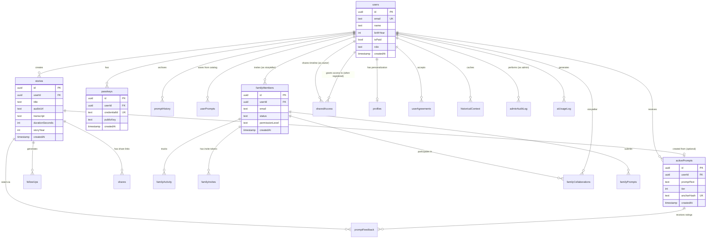

# HeritageWhisperV2 - Data Model Overview

> **Version:** 4.0  
> **Last Updated:** October 31, 2025  
> **Schema Version:** 22 production tables, synchronized with live database  
> **Purpose:** High-level overview and navigation to detailed documentation  

## Navigation

- **[SCHEMA_REFERENCE.md](SCHEMA_REFERENCE.md)** - Detailed table documentation (all 22 tables)
- **[RPC_FUNCTIONS.md](RPC_FUNCTIONS.md)** - PostgreSQL RPC functions and triggers
- **[ANTI_PATTERNS.md](ANTI_PATTERNS.md)** - Common mistakes and best practices
- **[DATA_FLOW_PATTERNS.md](DATA_FLOW_PATTERNS.md)** - Operation workflows and sequences

## Table of Contents
1. [Overview](#overview)
2. [Field Naming Convention](#field-naming-convention)
3. [Technology Stack](#technology-stack)
4. [Entity-Relationship Diagram](#entity-relationship-diagram)
5. [Quick Reference](#quick-reference)
6. [Core Table Summary](#core-table-summary)

---

## Overview

HeritageWhisperV2 uses a **three-layer data architecture**:

- **Database Layer (PostgreSQL):** 22 production tables (16 core + 6 auxiliary) managed via Supabase
- **Service Layer (Next.js API Routes):** REST API with JWT authentication, direct Supabase client queries
- **UI Layer (React/TypeScript):** TanStack Query v5 for state management

**Key Technologies:**
- Database: PostgreSQL 17+ via Supabase (project: pwuzksomxnbdndeeivzf)
- Schema Definition: Drizzle ORM for type-safe schemas (shared/schema.ts)
- API: Next.js 15 App Router API routes using Supabase client directly
- State: TanStack Query v5 + React Context
- Auth: Supabase Auth with JWT tokens + WebAuthn passkeys
- Security: Row Level Security (RLS) enabled on all 22 tables

**Type Safety Coverage:** 100% - All tables have TypeScript types via Drizzle ORM

**Important:** While Drizzle ORM provides type definitions, API routes query the database using Supabase client methods (`.from("table_name")`) rather than ORM queries.

---

## Field Naming Convention

**Critical for Development:** HeritageWhisperV2 uses different naming conventions at different layers:

| Layer | Convention | Example | Usage |
|-------|-----------|---------|-------|
| **Database (PostgreSQL)** | snake_case | `story_year`, `audio_url` | Raw SQL, migrations, RLS policies |
| **TypeScript/Drizzle** | camelCase | `storyYear`, `audioUrl` | Application code, type definitions |
| **Supabase Client Queries** | snake_case | `.eq('user_id', id)` | API route filters |

### Automatic Mapping
Drizzle ORM automatically maps between snake_case (DB) and camelCase (TypeScript). When you query:
```typescript
const story = await db.select().from(stories).where(eq(stories.userId, id))
```
Drizzle converts `stories.userId` → `user_id` in the SQL query.

### Manual Mapping Required
Supabase client queries use database names directly:
```typescript
// ✅ Correct - database field names
const { data } = await supabase.from('stories').select('*').eq('user_id', userId)

// ❌ Wrong - camelCase won't work
const { data } = await supabase.from('stories').select('*').eq('userId', userId)

// Result has snake_case fields - must map to camelCase for TypeScript
const mappedStory = { storyYear: data.story_year, audioUrl: data.audio_url }
```

**When Writing SQL:** Migrations, RLS policies, and RPC functions must use snake_case.

---

## Technology Stack

### Database & ORM
- **PostgreSQL 17+** via Supabase Cloud
- **Drizzle ORM** for type-safe schema definitions
- **Row Level Security (RLS)** enabled on all 22 tables
- **Supabase Client** for direct database queries (not ORM-based)

### API & Authentication
- **Next.js 15** App Router API routes
- **Supabase Auth** JWT tokens + session management
- **WebAuthn passkeys** for passwordless auth (iron-session)
- **Custom JWT** for passkey users (Supabase-compatible)

### State Management
- **TanStack Query v5** for server state
- **React Context** for auth state
- **SessionStorage** for activity tracking

### Security
- **RLS Policies** on all tables
- **CSRF Protection** via middleware
- **Rate Limiting** via Upstash Redis
- **Input Sanitization** for AI prompts
- **EXIF Stripping** for image uploads

---

## Entity-Relationship Diagram



---

## Quick Reference

### Most Common Queries

**Get User Stories:**
```typescript
const { data } = await supabase
  .from('stories')
  .select('*')
  .eq('user_id', userId)
  .order('created_at', { ascending: false });
```

**Check AI Budget:**
```typescript
const { data } = await supabase.rpc('check_ai_budget', { 
  p_user_id: userId,
  p_operation: 'transcription',
  p_estimated_cost: 0.25
});
```

**Archive Expired Prompts:**
```typescript
const { data } = await supabase.rpc('archive_expired_prompts');
```

**Get Active Prompts for User:**
```typescript
const { data } = await supabase
  .from('active_prompts')
  .select('*')
  .eq('user_id', userId)
  .eq('user_status', 'available')
  .order('created_at', { ascending: false })
  .limit(10);
```

### Critical RLS Notes

- ✅ All 22 tables have RLS enabled
- ✅ Use `supabaseAdmin` ONLY for admin operations that bypass RLS
- ✅ Regular queries use `supabase` client (respects RLS)
- ⚠️ Service role key used in 107 files - audit recommended

### Data Validation

**Story Duration** (enforced at DB level):
```sql
CHECK (duration_seconds BETWEEN 1 AND 120)
```

**File Upload Size** (enforced at API level):
```typescript
const MAX_SIZE = 25 * 1024 * 1024; // 25MB
if (buffer.length > MAX_SIZE) throw new Error('File too large');
```

---

## Core Table Summary

### User & Authentication (3 tables)
- **users** - Main user accounts with authentication and preferences
- **passkeys** - WebAuthn credentials for passwordless authentication
- **user_agreements** - Terms of Service and Privacy Policy tracking

### Content (2 tables)
- **stories** - User-generated story content with audio and transcripts
- **shares** - Public/private story sharing with view tracking

### AI Prompt System (4 tables)
- **active_prompts** - Currently active AI-generated prompts
- **prompt_history** - Archived used/skipped/expired prompts
- **user_prompts** - User-saved prompts from catalog
- **prompt_feedback** - Quality ratings for AI prompts (admin tool)

### Family Sharing (5 tables)
- **family_members** - Family member invitations and access
- **family_invites** - Token-based invitation system
- **family_collaborations** - Multi-tenant access control
- **family_prompts** - Family-submitted questions
- **family_activity** - Family engagement tracking

### Admin & Monitoring (3 tables)
- **admin_audit_log** - Admin action audit trail
- **ai_usage_log** - AI API usage and cost tracking
- **prompt_feedback** - Prompt quality ratings

### Auxiliary Tables (6 tables)
- **recording_sessions** - Temporary recording flow state
- **subscriptions** - Stripe subscription management (schema only)
- **gift_passes** - Gift subscription codes (schema only)
- **events** - Analytics event tracking (schema only)
- **usage_tracking** - Service cost tracking (legacy, replaced by ai_usage_log)
- **activity_notifications** - Real-time notifications (schema only)

For detailed field descriptions, see **[SCHEMA_REFERENCE.md](SCHEMA_REFERENCE.md)**.

---

## Database Objects

- **Tables:** 22 production tables (16 core + 6 auxiliary)
- **Views:** 1 (`prompt_quality_stats`)
- **RPC Functions:** 15+ database functions
- **Triggers:** 5 auto-update triggers
- **Indexes:** 50+ performance indexes

For complete RPC function documentation, see **[RPC_FUNCTIONS.md](RPC_FUNCTIONS.md)**.

---

## Common Mistakes

See **[ANTI_PATTERNS.md](ANTI_PATTERNS.md)** for comprehensive guide on:
- Field naming pitfalls
- RLS bypass risks
- Service key misuse
- Query optimization
- Data validation patterns

---

## Operation Workflows

See **[DATA_FLOW_PATTERNS.md](DATA_FLOW_PATTERNS.md)** for detailed sequences:
- Story creation flow
- Prompt generation flow
- Family sharing flow
- Export flows (PDF, data)
- Authentication flows

---

**Schema File Reference:** [`/shared/schema.ts`](shared/schema.ts)

**Production Database:** Supabase project `pwuzksomxnbdndeeivzf` (PostgreSQL 17+)

**Row Level Security:** Enabled on all 22 tables with optimized `(SELECT auth.uid())` pattern

---

_Last verified: October 31, 2025 - All 22 production tables synchronized with live Supabase database_
