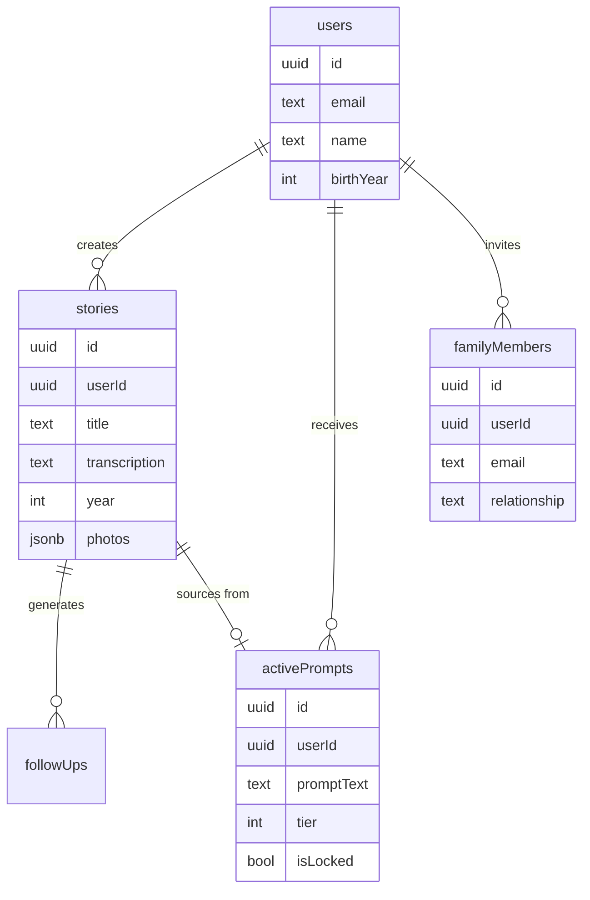
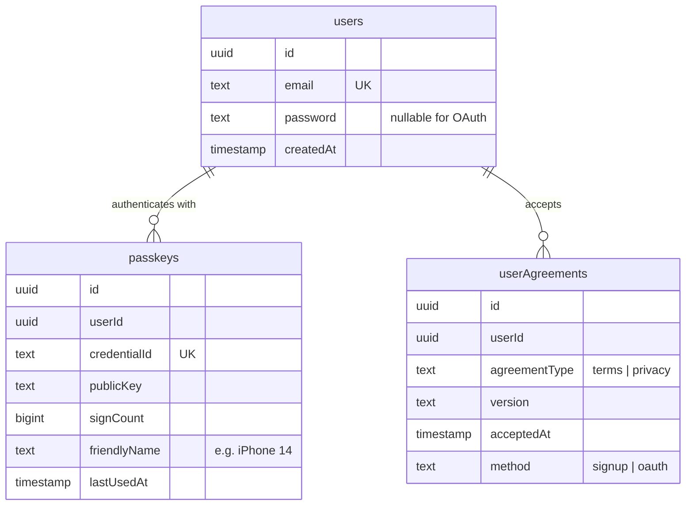
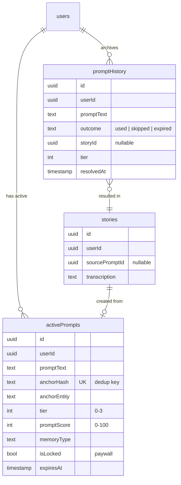
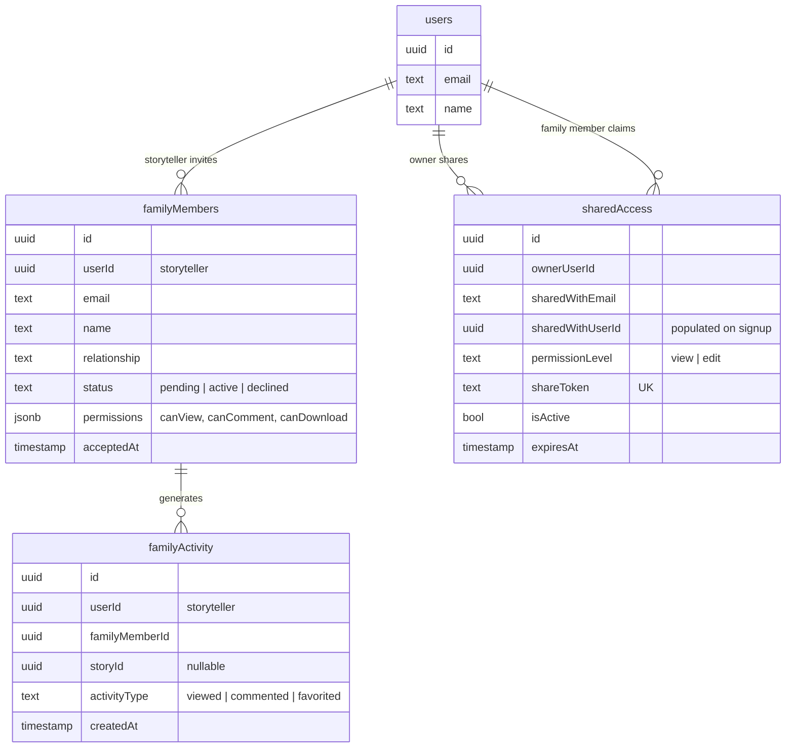
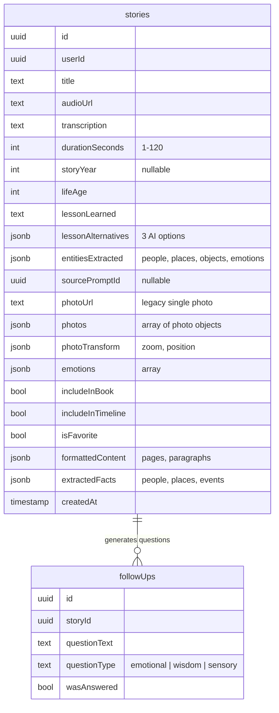

# HeritageWhisperV2 - Entity-Relationship Diagrams

> **Quick Reference:** Visual database schema diagrams

## Complete Database Schema

```mermaid
erDiagram
    users ||--o{ stories : "creates"
    users ||--o{ passkeys : "has"
    users ||--o{ activePrompts : "receives"
    users ||--o{ promptHistory : "archives"
    users ||--o{ familyMembers : "invites (as storyteller)"
    users ||--o{ sharedAccess : "shares timeline (as owner)"
    users ||--o| profiles : "has personalization"
    users ||--o{ userAgreements : "accepts"
    users ||--o{ historicalContext : "caches"

    stories ||--o{ followUps : "generates"
    stories ||--o| activePrompts : "sources from (optional)"

    familyMembers ||--o{ familyActivity : "tracks"

    sharedAccess }o--|| users : "grants access to (when registered)"

    users {
        uuid id PK
        text email UK
        text password "nullable"
        text name
        int birthYear
        text bio
        text profilePhotoUrl
        int storyCount
        bool isPaid
        jsonb profileInterests
        timestamp createdAt
    }

    passkeys {
        uuid id PK
        uuid userId FK
        text credentialId UK
        text publicKey
        bigint signCount
        text friendlyName
        timestamp createdAt
    }

    stories {
        uuid id PK
        uuid userId FK
        text title
        text transcription
        int storyYear
        int lifeAge
        text lessonLearned
        jsonb photos
        jsonb photoTransform
        bool isFavorite
        timestamp createdAt
    }

    activePrompts {
        uuid id PK
        uuid userId FK
        text promptText
        text anchorHash UK
        int tier "0-3"
        int promptScore "0-100"
        bool isLocked
        timestamp expiresAt
    }

    promptHistory {
        uuid id PK
        uuid userId FK
        text promptText
        text outcome "used | skipped | expired"
        uuid storyId FK
        timestamp resolvedAt
    }

    familyMembers {
        uuid id PK
        uuid userId FK
        text email
        text relationship
        text status "pending | active"
        jsonb permissions
    }

    familyActivity {
        uuid id PK
        uuid userId FK
        uuid familyMemberId FK
        uuid storyId FK
        text activityType
        timestamp createdAt
    }

    sharedAccess {
        uuid id PK
        uuid ownerUserId FK
        text sharedWithEmail
        uuid sharedWithUserId FK
        text shareToken UK
        text permissionLevel
        bool isActive
    }

    profiles {
        uuid id PK
        uuid userId FK UK
        int birthYear
        text preferredStyle
        jsonb majorLifePhases
    }

    followUps {
        uuid id PK
        uuid storyId FK
        text questionText
        bool wasAnswered
    }

    historicalContext {
        uuid id PK
        uuid userId FK
        text decade
        jsonb facts
    }

    userAgreements {
        uuid id PK
        uuid userId FK
        text agreementType "terms | privacy"
        text version
        timestamp acceptedAt
    }
```

## Core Entities Simplified



## Authentication System



## AI Prompt System



## Family Sharing System



## Story Data Structure



---

## Key Relationships Summary

**One-to-Many:**
- User → Stories
- User → Passkeys (multiple devices)
- User → ActivePrompts (1-5 at a time)
- User → PromptHistory (archives)
- User → FamilyMembers (as storyteller)
- Story → FollowUps

**One-to-One:**
- User → Profile (extended personalization)

**Optional Foreign Keys:**
- Story → ActivePrompt (via `source_prompt_id`, nullable)
- PromptHistory → Story (via `story_id`, nullable if skipped/expired)
- SharedAccess → User (via `shared_with_user_id`, nullable until signup)

**Composite Unique:**
- Passkey(userId, credentialId) - Prevents cross-tenant credential reuse

**Deduplication:**
- ActivePrompts: `anchor_hash` = sha1(`${tier}|${entity}|${year}`)

---

_For complete data model documentation including service and UI layers, see [DATA_MODEL.md](../DATA_MODEL.md)_